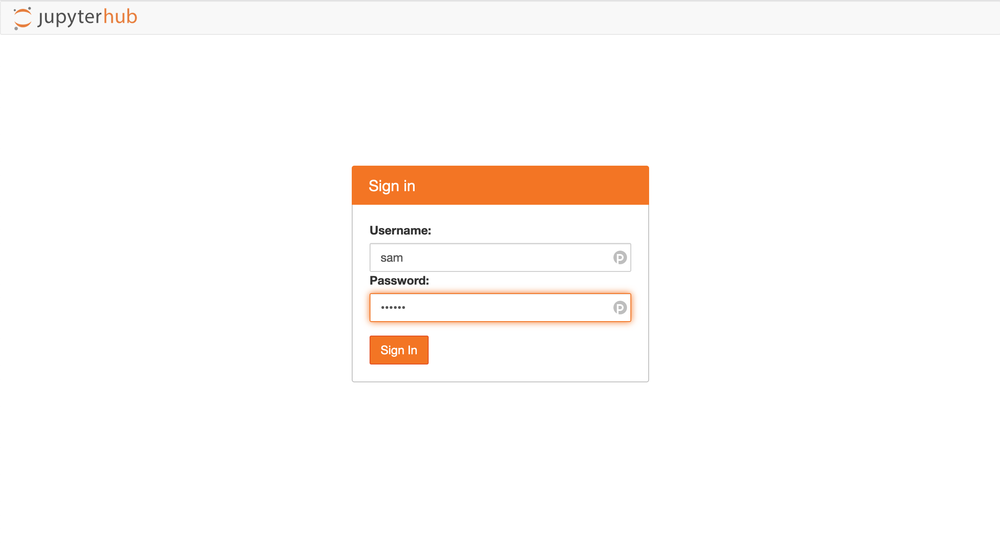
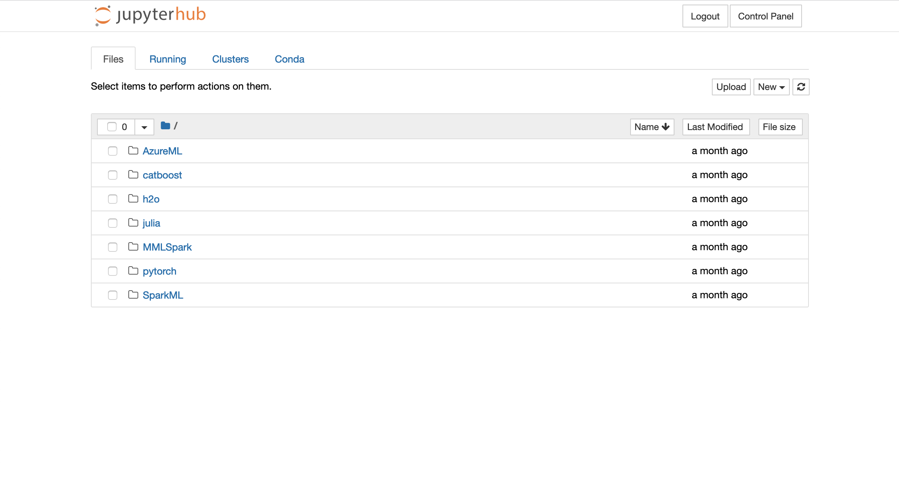

# Multi-user JupyterHub

In this guide we will deploy a virtual machine hosting a
[JupyterHub](https://jupyter.org/hub) instance configured for all your users.
We will take advantage of the Azure [data science virtual
machine](https://azure.microsoft.com/en-us/services/virtual-machines/data-science-virtual-machines/)
which comes with all of the packages we need.

## 🏗️ Terraform variables

First, lets edit the terraform variables. Open
[`terraform/terraform.tfvars`](../terraform/terraform.tfvars) in your editor.

The default B2s machine size is a bit underpowered for JupyterHub. The example
D8s v4 size is more suitable so uncomment that line.

```diff
# Default = "Standard_B2s"
#
# Example:
-# vm_size = "Standard_D8s_v4"
+vm_size = "Standard_D8s_v4"
```

Alternatively if you want to leverage a GPU in your work, you can deploy a size
with a GPU as the data science virtual machine image already has the drivers
installed. For example

```diff
# Default = "Standard_B2s"
#
# Example:
-# vm_size = "Standard_D8s_v4"
+vm_size = "Standard_NC6"
```

Next, specify the Ubuntu data science virtual machine image, also in
[`terraform/terraform.tfvars`](../terraform/terraform.tfvars).

```diff
# Example (An Ubuntu 18.04 data science virtual machine):
-# vm_image = {
-#   publisher = "microsoft-dsvm"
-#   offer     = "ubuntu-1804"
-#   sku       = "1804"
-#   version   = "latest"
-# }
+vm_image = {
+  publisher = "microsoft-dsvm"
+  offer     = "ubuntu-1804"
+  sku       = "1804"
+  version   = "latest"
+}
```

## 🛳️ JupyterHub port

The JupyterHub web interface runs on port 8000. However, if you look at
[`main.tf`](../terraform/main.tf) you will see that inbound traffic is only
allowed on one port, port 22 for SSH. We need to add a rule to allow inbound
traffic on port 8000 to use JupyterHub

```diff
 network_security_group_name = azurerm_network_security_group.nsg.name
 }

+# Create JupyterHub NSG rule
+resource "azurerm_network_security_rule" "jupyterhub" {
+  name                        = "JupyterHub"
+  priority                    = 1002
+  direction                   = "Inbound"
+  access                      = "Allow"
+  protocol                    = "Tcp"
+  source_port_range           = "*"
+  destination_port_range      = "8000"
+  source_address_prefix       = "*"
+  destination_address_prefix  = "*"
+  resource_group_name         = azurerm_resource_group.rg.name
+  network_security_group_name = azurerm_network_security_group.nsg.name
+}
+
 # Create network interface
 resource "azurerm_network_interface" "nic" {
   name                = "${var.prefix}NIC"
```

## 👩‍💻 Add users

JupyterHub takes advantage of [PAM](https://en.wikipedia.org/wiki/Linux_PAM) so
that all of the system users may log into the web interface using their username
and password.

Declare your users in [`ansible_vars.yaml`](../ansible/ansible_vars.yaml)
following the template. Here are some tips,

- Although passwords are optional, make sure that you define one for each user
  so that they can authenticate with JupyterHub
- If these users will not need to access the machine via SSH, there is no need
  to declare an SSH keys
- Use the [`generate_password.py`](../scripts/generate_password.py) script to
  create password hashes for each user. Instructions can be found in the
  [scripts directory README](../scripts/README.md)

```diff
 #
 # Example:
-# users:
-#   - name: Harry Lime
-#     username: harry
-#     password: "$6$AHWU2/Si7zYj7cuJ$qiBAb03b6BdNM7Zjek1vhmmFlzGRDrIyj2H5Fz2jwx/pshy7XrZFrKc8owUGKwT1lmW3x9zANFdryR4MuDT1I/"
-#     ssh_key:
-#       - "ssh-rsa ..."
-#       - "https://github.com/harrylime.keys"
-#       - "{{ lookup('file', '/home/harry/.ssh/id_rsa.pub') }}"
-#     groups: [admin]
+users:
+  - name: Harry Lime
+    username: harry
+    password: "$6$AHWU2/Si7zYj7cuJ$qiBAb03b6BdNM7Zjek1vhmmFlzGRDrIyj2H5Fz2jwx/pshy7XrZFrKc8owUGKwT1lmW3x9zANFdryR4MuDT1I/"
+  - name: Sam Spade
+    username: sam
+    password: "$6$HfRXgvGNmqphXU0k$8LIV9yqj4yHVyzIS5prukdxi43bdj5Y.n9D7qB1njJ5p967hYK3QSBi6jralc6IzmfAyRN2fJOFRxkVYw0ji10"
+

 # Users to disable or delete
 #
```

## 🖥️ Deploy the virtual machine

Follow the [normal procedure](../README.md#how-to-use-this-repository) to
deploy and configure the machine using Terraform and Ansible.

The initial setup of the data science virtual machine can take some time and the
new virtual machine may be unresponsive at first. If Ansible reports that the
host is unreachable, wait a few minutes and try again.

## 🛰️ Connect to JupyterHub

The final output of Ansible will be the IP address of your virtual machine. In a
web broswer, navigate to the JupyterHub web interface at
`https://<ip_address>:8000`.

JupyterHub has been set up with a self-signed certificate, which your browser
will probably warn you about, but it is fine to accept the certificate.

Now you will be presented with the JupyterHub login page. Enter the username and
password of your linux account, that you declared in
[`ansible_vars.yaml`](../ansible/ansible_vars.yaml) to login.



After authenticating you will see that your JupyterHub instance is already
populated with examples which you can try running.



You might also want to look
at the [Data science with an Ubuntu Data Science Virtual Machine in
Azure](https://docs.microsoft.com/en-us/azure/machine-learning/data-science-virtual-machine/linux-dsvm-walkthrough)
guide for more information on using the data science virtual machine.
